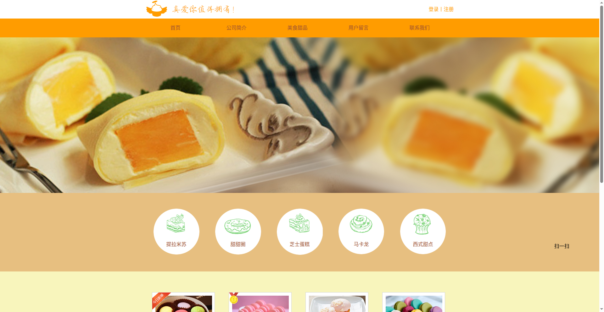

# Dessert Website

A responsive single-page website for a dessert shop, built with HTML and CSS. It showcases products (tiramisu, donuts, cheesecake, macarons, and more) with prices, plus sections for company info and contact.

## Preview

## Tech Stack

- HTML5
- CSS3 (responsive layout with media queries)

## Features

- Responsive design that adapts to desktop and mobile screens
- Product menu with images and prices
- Navigation sections: Home, About, Desserts, Messages, Contact

## How to Run

No build step needed — it's a static site:

1. Clone or download this repository.
2. Open `Dessert Website/Dessert Website.html` in any modern browser.

## Live Demo

👉 [Live Demo](https://iancai119.github.io/dessert-website/Dessert%20Website/Dessert%20Website.html)
